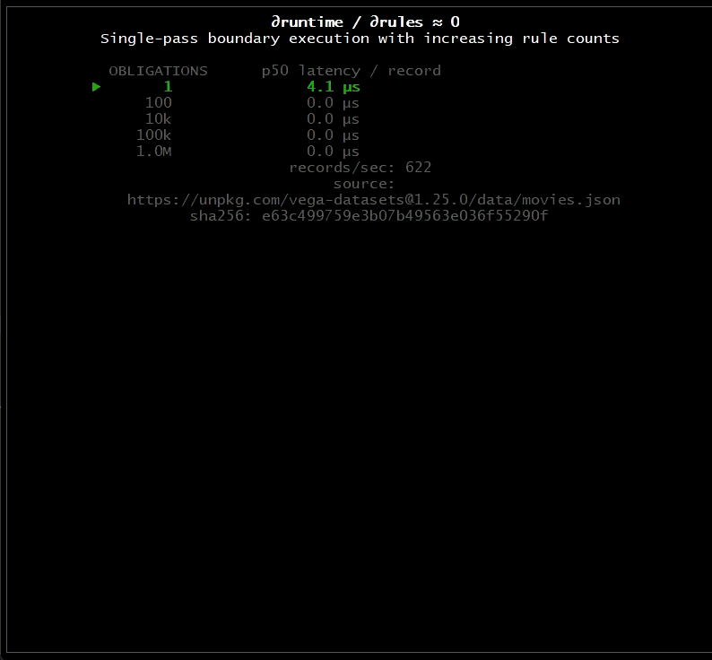

# ∂runtime / ∂rules ≈ 0

A small experiment in single-pass boundary execution showing per-record runtime invariant to the number of compiled obligations.
The behavior is the point.

---

## Live Demos

See Pounce in action with real performance data:

- **[Flat Scaling Demo](demos/flat-scaling.md)** - 100,000× more rules, same cost
- **[AI Cost Savings Demo](demos/ai-gate.md)** - 23.8% reduction in LLM tokenization costs ($14M/year at scale)
- **[Semantic Scanning Demo](demos/semantic-scanning.md)** - 2.9× faster than DOM parsing

## Pitch Deck

[View the full investor presentation →](https://michael-a-kuykendall.github.io/dzero/)

---

This work is provisionally patented.
Contact: mike [at] greased-lightning [dot] io
